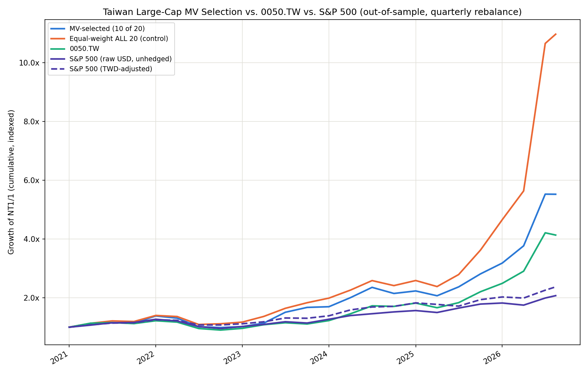

# Markowitz Efficient Frontier + QUBO/QAOA Cardinality-Constrained Portfolio

Two portfolio optimization problems solved on the same real market data,
side by side:

1. **Classical continuous Markowitz (Modern Portfolio Theory).**
   Monte Carlo simulation of random long-only portfolios plus an exact
   efficient frontier traced with `scipy.optimize` (SLSQP). Standard
   quadratic-programming MPT — no restriction on how many assets you hold.

2. **Cardinality-constrained selection (NP-hard combinatorial extension).**
   Add the real-world constraint "hold exactly K of these N assets" and
   the problem stops being a continuous QP and becomes a combinatorial
   search over `C(N, K)` subsets. It's encoded as a QUBO (Quadratic
   Unconstrained Binary Optimization), mapped to an Ising Hamiltonian,
   and its ground state is found two ways for comparison:
   - `NumPyMinimumEigensolver` — exact diagonalization (ground truth,
     only tractable because N stays around 10-12 qubits).
   - `QAOA` — the variational quantum heuristic, run on Qiskit's
     statevector simulator.

The two are plotted together: the constrained (K-of-N) solutions sit on
or inside the unconstrained efficient frontier, showing the price of
the cardinality constraint in risk/return terms.

## Why this problem, and not a synthetic one

Cardinality-constrained mean-variance is the most-cited "quantum
finance" example precisely because it's the smallest natural step from
classical MPT into NP-hard territory: swap "how much of each asset" for
"which K assets," and the feasible set changes from a simplex to a
combinatorial one. At 10-12 assets it also fits on a laptop simulator,
so the QAOA result can be checked directly against the exact
ground state rather than taken on faith.

## Setup

Use an isolated virtual environment — see the version-drift note below for
why this matters more than usual here:

```bash
python3 -m venv .venv
.venv/bin/pip install -r requirements.txt
```

Then run everything through `.venv/bin/python3` / `.venv/bin/streamlit`
(or `source .venv/bin/activate` first).

**Version note:** `qiskit-finance` is now community-maintained under the
`qiskit-community` org, and 0.4.x removed several previously-deprecated
import paths. In this environment, `PortfolioOptimization` lives in
`qiskit_finance.applications` — **not**
`qiskit_optimization.applications`, which is where a lot of older
tutorials import it from. If you upgrade any of the `qiskit-*` packages
independently, re-check that import before assuming old code/tutorials
still apply.

This isn't hypothetical: mid-development, something on this machine
repeatedly (twice) silently downgraded the global `qiskit` 2.5.1 → 1.2.4
and `qiskit-algorithms` 0.4.0 → 0.3.1 install between my commands, which
changes QAOA's expected sampler type (V2 → V1) and breaks it with an
opaque `TypeError` deep inside COBYLA's callback. Reinstalling the pinned
versions globally didn't stick — something else on this system keeps
resetting global site-packages. **The `.venv` above exists specifically
to be immune to that**; don't skip it in favor of a bare `pip install`
into the system Python. `src/quantum_solver.py`'s `check_versions()`
still checks installed-vs-pinned versions and surfaces a clear warning
(in both `main.py` and `app.py`) instead of that opaque error, as a
belt-and-suspenders check.

## Usage

### Web app (Streamlit)

```bash
.venv/bin/streamlit run app.py
```

Opens an interactive dashboard: set tickers/period/budget/risk settings
in the sidebar, run the classical optimization, then build the QUBO and
solve it exactly and/or with QAOA. The exact solver is instant; QAOA runs
in a background thread (with a live elapsed-time indicator) so the rest
of the UI stays usable while it grinds through the optimizer loop — see
the runtime warning in the sidebar before cranking up `reps`/`maxiter`.

A second page, **Taiwan Backtest** (sidebar, `pages/1_Taiwan_Backtest.py`),
shows the out-of-sample Taiwan top-20 backtest as two comparisons of the
QUBO-selected strategy against the equal-weight-all-20 control: cumulative
growth (optionally with 0050.TW and the TWD-adjusted S&P 500) and annualized
return / volatility / Sharpe side by side. It reads the precomputed curves in
`outputs/tw_backtest_curves.csv` rather than re-running ~23 exact QUBO solves
per page load; regenerate them with
`.venv/bin/python3 tw_backtest_main.py --end 2026-08-14`.

### CLI

```bash
.venv/bin/python3 main.py \
  --tickers AAPL MSFT GOOGL AMZN NVDA META TSLA JPM V PG \
  --period 3y \
  --budget 5 \
  --risk-factor 0.5 \
  --qaoa-reps 3
```

- `--tickers`: 10-12 recommended (maps 1:1 to qubits in the QAOA circuit).
- `--budget`: K, the number of assets to hold (cardinality constraint).
- `--risk-factor`: risk-aversion coefficient `q` in `q * x^T Sigma x - mu^T x`.
- `--qaoa-reps`: QAOA circuit depth (p). Higher = better approximation,
  slower classical optimizer loop.

Output: console summary of the continuous max-Sharpe / min-vol
portfolios, the exact vs. QAOA cardinality-constrained selections and
their objective gap, plus a saved PNG (`outputs/efficient_frontier.png`)
overlaying all of them on one risk/return chart.

## Project layout

```
src/
  data.py             fetch prices (yfinance), compute annualized mu / Sigma
  classical_mpt.py    Monte Carlo simulation + SLSQP efficient frontier
  qubo_portfolio.py   cardinality-constrained QUBO (qiskit-finance PortfolioOptimization)
  quantum_solver.py   exact (NumPyMinimumEigensolver) vs QAOA solvers, version guard
  plotting.py         matplotlib chart (CLI) + Plotly charts (web app) + backtest/live-tracking charts
  tw_universe.py       TWSE+TPEx universe -> liquidity/market-cap top-N candidate pool
  tw_data.py            shared cached data-fetching layer (candidates + benchmarks + FX)
  tw_backtest.py        out-of-sample rolling-rebalance backtest engine
  tw_portfolio.py       persisted "default portfolio" state, lot-size share allocation
main.py               CLI orchestrating the full pipeline
app.py                Streamlit web app (interactive, background QAOA) -- 10-ticker demo
pages/1_Taiwan_Backtest.py  Streamlit page: QUBO selection vs. equal-weight control (precomputed backtest)
tw_backtest_main.py   Taiwan large-cap historical backtest: QUBO selection vs. 0050.TW vs. S&P 500
                      (also writes outputs/tw_backtest_curves.csv for the Streamlit page)
tw_portfolio_tool.py  Taiwan QUBO Portfolio Tool -- the live decision tool (see below)
```

## Math reference

Continuous MPT (long-only, fully invested):

```
minimize   w^T Sigma w
subject to sum(w) = 1,  w_i >= 0
```

swept across target returns to trace the frontier, plus the closed-form
Sharpe-maximizing and variance-minimizing special cases.

Cardinality-constrained selection (equal-weighted, binary):

```
minimize   q * x^T Sigma x  -  mu^T x
subject to sum(x_i) = K,  x_i in {0, 1}
```

which is exactly `qiskit_finance.applications.PortfolioOptimization`'s
`to_quadratic_program()` output, converted to an Ising Hamiltonian via
`QuadraticProgram.to_ising()` for QAOA/VQE.

## Observed results (10 tickers, budget=5, risk_factor=0.5)

```
Exact (NumPyMinimumEigensolver): objective=-0.940630  time=0.01s   selected=['GOOGL', 'AMZN', 'NVDA', 'JPM', 'V']
QAOA (reps=3, maxiter=200):      objective=-0.736344  time=1382s   selected=['AAPL', 'MSFT', 'NVDA', 'JPM', 'V']  gap=+0.204286
QAOA (reps=1, maxiter=50):       objective=-0.934755  time=198s    gap=+0.005875
```

Worth internalizing: at this problem size the exact solver is both faster
(milliseconds vs. minutes on a laptop) and guaranteed optimal, while QAOA
is a heuristic whose quality depends on depth/iteration budget in a way
that isn't simply "more is better" -- the shallower reps=1 run actually
landed *closer* to optimal than the deeper reps=3 run here, because
COBYLA got stuck in a worse local optimum at higher dimensionality. This
is the honest current state of NISQ-era QAOA on classically-simulable
problem sizes: it is not yet reliably competitive with brute-force
diagonalization, and the value of the exercise is in building the QUBO ->
Ising -> QAOA pipeline correctly and being able to *measure* the gap and
its variance, not in QAOA winning. The web app's sidebar defaults to
reps=1/maxiter=50 for this reason -- a reasonable few-minutes-not-tens-
of-minutes starting point, tunable from there.

## Known limitations

- Simulator only — QAOA runs on `StatevectorSampler`, not real quantum
  hardware. That's a deliberate scope choice (this is meant to run
  end-to-end on a laptop), not a claim about NISQ hardware performance.
- Qubit count = number of candidate tickers. State-vector simulation is
  fine through the low teens; don't push `--tickers` much past 12-14
  without switching to a shot-based sampler or fewer reps.
- Expected returns and covariance are historical-mean estimates
  (annualized sample mean/covariance of log returns) — the well-known
  estimation-error sensitivity of Markowitz applies here too.

## Taiwan large-cap backtest: QUBO selection vs. 0050.TW vs. S&P 500

`tw_backtest_main.py` extends the same QUBO machinery to a real,
much larger universe: all TWSE (上市) + TPEx (上櫃) ordinary common
stocks (~2000 securities), narrowed to a tractable candidate pool, then
back-tested out-of-sample with periodic rebalancing against 0050.TW
(Taiwan 50 ETF) and the S&P 500 (opportunity-cost benchmark).

### Why a two-stage design

The QUBO formulation here assigns one qubit per candidate asset.
"Choose 10 of ~2000" would need ~2000 qubits — impossible on any
simulator or current real quantum hardware. So this pulls the full
TWSE+TPEx universe via their official OpenAPI (`src/tw_universe.py`),
screens out Innovation-Board listings (thin free-float distorts
shares-outstanding x price market cap — one such name showed a
nominal NT$1.4T market cap on NT$274M of daily turnover, 4x thinner
than TSMC's already-low turnover ratio) and illiquid names, then ranks
by market cap to a **top-20 pool**. That pool is small enough (20
qubits) for the exact solver to run in ~0.25s per rebalance.

### Backtest design

- **Candidate pool**: fixed top-20 by *current* market cap (see
  limitation below), 2021-01-01 through 2026-08-14.
- **Rebalance**: quarterly. At each rebalance date, mu/Sigma are
  estimated from a trailing **2-year lookback window ending at that
  date only** — no data after the rebalance date informs the
  selection, so the stock-picking decision itself is genuinely
  out-of-sample.
- **Selection**: exact QUBO/Ising ground state (`NumPyMinimumEigensolver`),
  choose 10 of 20, equal-weighted. QAOA was benchmarked at this size
  (see below) but is far too slow to run at every one of the ~23
  rebalance dates in this window.
- **Control**: equal-weight **all 20** candidates, no selection,
  same rebalance grid — isolates how much of any result comes from
  the candidate pool itself vs. the QUBO's mean-variance selection.

### Results (2021-01-01 -> 2026-08-14, quarterly rebalance, budget=10 of 20, q=0.5)

```
TWD/USD: 28.08 -> 32.12 (+14.41% TWD move vs USD over the window)

QUBO-selected (10 of 20)         total=+452.39%  annualized=+35.58%  vol=29.33%  sharpe=1.21
Equal-weight ALL 20 (control)    total=+997.09%  annualized=+53.20%  vol=40.90%  sharpe=1.30
0050.TW                          total=+313.49%  annualized=+28.76%  vol=25.85%  sharpe=1.11
S&P 500 (raw USD, unhedged)      total=+107.28%  annualized=+13.86%  vol=14.12%  sharpe=0.98
S&P 500 (TWD-adjusted)           total=+137.15%  annualized=+16.62%  vol=12.73%  sharpe=1.31
```



**On the currency question specifically**: the raw-USD S&P 500 number
understates what a TWD-based investor actually would have realized,
because TWD depreciated ~14.4% against USD over this window (28.08 ->
32.12) — so USD-denominated holdings were worth more in TWD terms by
the end. `fx_adjusted_benchmark_curve()` in `src/tw_backtest.py`
computes the correct opportunity-cost number: `(1 + USD return) x (1 +
TWD move) - 1`, using `TWD=X` from yfinance. That moves the S&P 500's
total return from +107.3% to +137.2% (annualized +13.9% -> +16.6%) —
still well behind 0050.TW and the QUBO strategy, but the FX effect is
real and non-trivial (~30 points of total return), and both numbers are
shown (dashed line = TWD-adjusted) rather than only the flattering one.
Interestingly its Sharpe (1.31) edges out every TW strategy here,
because currency and equity returns weren't perfectly correlated over
this window and combining them slightly reduced volatility relative to
the raw USD series (12.73% vs 14.12%) — a real diversification artifact
worth noting, not a claim that FX exposure reliably lowers risk.

**The honest reading of this, in order of importance:**

1. **All four strategies beat the S&P 500 opportunity cost** over this
   window (even after the TWD adjustment) — Taiwan's semiconductor/AI
   supply chain had an extraordinary run 2021-2026. This says more
   about the period than about any of these methods.
2. **The candidate-pool construction, not the QUBO, explains most of
   the outperformance over 0050/S&P500.** The pool is built from
   *today's* market caps and applied retroactively to 2021 — a
   look-ahead simplification (see below), not point-in-time historical
   ranking. The equal-weight-all-20 control has no selection logic at
   all and still beats every other line on the chart.
3. **The QUBO's risk-minimizing selection actually *underperformed*
   the naive equal-weight control here** — both on raw return (+35.6%
   vs +53.2% annualized) and on Sharpe (1.21 vs 1.30). This is
   expected, not a bug: `q * x^T Sigma x - mu^T x` explicitly
   penalizes variance, so it systematically trims the most volatile
   (often highest-beta, highest-return-in-a-rally) names. That's
   exactly the right behavior in a drawdown and the wrong one in a
   near-uninterrupted five-year bull market — this backtest window is
   close to a worst case for demonstrating mean-variance optimization's
   value, and it still landed ahead of 0050 and the S&P 500 on both
   axes.

### Limitations specific to this backtest

- **Look-ahead in the candidate pool.** The top-20 is ranked once,
  using the most recent (2026) market caps and liquidity, then applied
  to the entire 2021-2026 window. A stock that only became a top-20
  name recently is eligible for early-period selection too. This is
  the single biggest caveat — the equal-weight-20 control exists
  specifically to isolate its effect (see above), and it's large.
  Point-in-time universe construction (re-deriving the top-20 from
  *that quarter's* market caps at every rebalance) would remove this,
  at the cost of a much heavier data pipeline (historical daily
  turnover/shares-outstanding per stock, not just the current
  snapshot this project's data sources expose easily).
- **No transaction costs or taxes.** Quarterly reshuffling of a
  10-of-20 selection trades far more than 0050's near-static
  composition; realistic costs would narrow the gap in the QUBO
  strategy's favor relatively less than shown here.
- **Currency**: handled, not ignored — the chart shows both the raw USD
  S&P 500 and a TWD-adjusted version (see above); use the latter for
  "opportunity cost of investing abroad" framing. Residual caveat: the
  FX series (`TWD=X`) is a spot rate, not what a real cross-border
  investor would pay after spreads/fees on actual currency conversion.
- **QAOA at 20 qubits is intractable for a rolling backtest.** Exact
  solve took 0.25s; a single QAOA run at reps=1, maxiter=20 (a
  *smaller* budget than the 10-qubit project's reps=1/maxiter=50
  default) took over 15 minutes and was still running when last
  checked — versus ~200s at 10 qubits. That's roughly the 2^n
  simulation-cost scaling made concrete: doubling the qubit count did
  not double the runtime, it changed it by orders of magnitude. Running
  QAOA at all ~23 rebalance dates in this backtest was not attempted
  for that reason; the quantum-vs-exact comparison this project
  otherwise emphasizes is demonstrated at the 10-12 qubit scale
  (`main.py`/`app.py`), not here.

## Taiwan QUBO Portfolio Tool (tw_portfolio_tool.py)

This is the actual decision tool, distinct from the historical backtest
above. The backtest answers "how would this method have performed
2021-2026"; the tool answers "what should I hold right now, and how has
that specific decision actually performed since I made it" — a live
paper-trading tracker, not a fixed historical window.

```bash
.venv/bin/streamlit run tw_portfolio_tool.py
```

**How it works:**

1. On first use, click **Recompute best portfolio now** — fetches the
   live TWSE/TPEx top-N candidate pool, solves the cardinality-
   constrained QUBO (exact solver, sub-second), and **persists** the
   result to `.cache/default_portfolio.json` with today as the
   inception date. This is the "default portfolio."
2. Every subsequent open loads that saved state instantly and shows
   **live performance from the inception date to right now** (whenever
   "now" is) against 0050.TW, 0056.TW, 00878.TW, and the S&P 500
   (TWD-adjusted, using the same currency-conversion fix from the
   backtest above). Recomputing overwrites the state and resets the
   inception date — a deliberate action, not automatic.
3. **Editable holdings**: uncheck any stock, add any other pool ticker
   — the display re-weights equally among whatever's currently checked,
   live, no re-solve needed. **Add a specific ticker** not in the top-N
   pool and optionally **force** it into the next recompute (implemented
   via `QuadraticProgram.substitute_variables`, fixing that QUBO
   variable to 1 before solving). Right next to the editor, a
   **per-candidate table** (`tw_portfolio.py`'s `candidate_stats()`)
   shows every pool ticker's own annualized return/volatility/Sharpe —
   straight from the exact μ and diag(Σ) that drove the QUBO's
   selection, not a fresh estimate — sorted by Sharpe, with a ✓ for
   what's currently held. This deliberately uses each stock's *own*
   variance (ignoring covariance with the rest of the portfolio, since
   that's not defined for a single stock in isolation) — it exists to
   inform *which* stocks to add or remove, not to replace the
   portfolio-level, covariance-aware volatility in the Risk section.
   It's also a visible illustration of *why* mean-variance optimization
   isn't just "pick the top-K individual Sharpe ratios": in testing,
   two of the highest-individual-Sharpe candidates were correctly left
   unselected because of how they correlate with the rest of the
   basket, not because their own numbers were bad.
4. **Risk, alongside return**: return alone makes a mean-variance
   portfolio look strictly worse than a naive equal-weight one whenever
   equal-weight happened to win on raw return — exactly what happened in
   this project's own historical backtest (below). Four numbers, kept
   deliberately separate rather than merged into one:
   - **Ex-ante volatility** — `sqrt(wᵀΣw)` using the *same* annualized
     variance-covariance matrix (Σ) the QUBO optimized against at
     selection time (`src/tw_portfolio.py`'s `ex_ante_volatility()`,
     fed from `compute_default_portfolio()`'s own Σ estimate — not a
     re-estimate). A model prediction, available immediately.
   - **Ex-ante, equal-weight ALL pool** — the same formula and the same
     Σ, but `w` spread equally across every candidate in the pool
     instead of just the QUBO's picks: the "naive control," directly
     comparable to the line above with no waiting on live data, since
     both come from the same matrix computed at the same time. This is
     how to compare QUBO-selected vs. equal-weight risk *immediately*
     — asked and answered directly in-app, not just in this README.
   - **Realized volatility (since inception)** — annualized std. dev. of
     the portfolio's *actual* daily returns since it was set. Reads
     N/A until ≥10 trading days have accumulated. **That N/A is the
     correct answer, not a gap to paper over** — see "On not backfilling
     realized volatility" below for why an early version of this tool
     did exactly that, incorrectly, and was fixed.
   - **Realized Sharpe** — since-inception return over since-inception
     volatility, N/A under the same ≥20-day threshold.

   Comparing against 0050/S&P 500 specifically needs a different
   approach: they aren't part of the pool Σ was estimated over, so
   there's no ex-ante number for them, but unlike a fresh portfolio they
   have decades of real trading history — genuine realized volatility
   for them exists *right now*, just not through the live tracker (too
   new to be informative). Section 5 computes it properly instead: real,
   comparable annualized volatility for the QUBO strategy, the
   equal-weight control, 0050, and S&P 500 together, over a
   user-chosen window, using proper out-of-sample rolling re-selection
   — not today's fixed basket backfilled.

   All of the above are portfolio-level (the combined holdings'
   variance, not an average of each stock's own variance) —
   `Var(Σ wᵢrᵢ) = wᵀΣw` includes every covariance term automatically
   once you compute variance on the *combined* series, so this isn't
   optional plumbing; it's what makes the number correct instead of
   systematically wrong (overstating risk for diversified holdings,
   understating it for correlated ones).
5. **Position sizing**: given a capital amount, allocates shares per
   holding. Defaults to **odd-lot (零股)** trading (single shares) rather
   than board-lot-only (1000 shares/一張) — board-lot-only rounding at
   typical retail capital can zero out an entire position for an
   expensive stock (a single lot of a NT$2,000+ name needs NT$2M+),
   which is confusing more than useful as a default; toggle it off for
   brokers/accounts that require whole lots.
6. **Quantum verification** (opt-in): re-solves the same QUBO with QAOA
   and reports whether it agrees with the exact solver's selection and
   by how much the objective differs — a cross-check exposed as an
   optional slow action, not something that blocks the primary tool.
   At 20 qubits this can run from tens of minutes to well over an hour;
   the tool shows a concrete order-of-magnitude estimate (extrapolated
   from this project's own benchmarks, not a guess) before you click.
7. **Historical backtest reference** (opt-in, collapsed by default):
   reuses `tw_backtest.py`, but with a **user-chosen start date, end
   date (default: today), and rebalance frequency** — including genuine
   buy-and-hold (no rebalancing at all), not just a hardcoded 2021-now
   quarterly window. See "On alpha decay" below for why this matters.
8. **Weekly win/loss** (`src/tw_backtest.py`'s `periodic_win_loss()`):
   a single aggregate return over a multi-week window can hide that an
   edge was concentrated in one stretch and absent (or reversed)
   everywhere else — a single number can't distinguish "consistently
   ahead" from "won huge once, roughly broke even the rest of the time."
   This slices the SAME two fixed baskets from the Risk section (your
   current holdings vs. equal-weight across the whole pool — neither
   re-optimized within a period, unlike section 7's rolling backtest)
   into calendar weeks and reports each week's winner, a bar chart of
   the weekly difference (blue = your selection ahead that week, red =
   behind), and a win-rate summary. Defaults to since-inception, or 90
   days back if the portfolio is fresher than that (otherwise there's
   nothing to show yet on a portfolio computed today).

### On alpha decay

Backtests in this space default to long windows (this project's own
CLI backtest uses 2021-2026) because more data looks more rigorous. But
a real trading edge can have a short shelf life — the effect that made
it work can compress, get arbitraged away, or simply have been a
feature of one specific regime, in weeks or months rather than years.
This is usually called **alpha decay** (an edge's predictive power
fading over time as the market adapts to it, or as the regime that
produced it ends) — related to, but distinct from, plain overfitting:
even a genuine, non-overfit effect can be time-limited. A tool that can
only be evaluated against one fixed multi-year window can't tell the
difference between "this works" and "this worked, in that window."

Section 5 exists specifically so you can test a week, a month, or a
quarter, not just multi-year windows — pick a short "Start holding"
date and "Buy-and-hold (no rebalancing)" to see whether this
methodology's edge (if any) shows up over a horizon short enough that a
decaying or regime-specific effect would be visible as a sign flip or a
collapse toward the equal-weight control, rather than being averaged
away across years of data.

### On not backfilling realized volatility

An earlier version of this tool added a "trailing volatility" metric
computed by applying *today's* selected basket and equal weights to
those stocks' own historical prices over the lookback window, to avoid
showing N/A on a freshly-computed portfolio. This was wrong, and worth
recording why rather than just quietly fixing it:

- It's a **pro-forma backtest of the current selection**, not something
  realized — nobody held that basket over that window, since it didn't
  exist as a selection until today.
- It's **partially circular**: the QUBO selects stocks partly *because*
  of their trailing covariance structure, so "realized" volatility of
  that same selection over that same window mostly re-derives the
  ex-ante number under a misleading label, rather than independently
  cross-checking it.
- Placed in the same table column as benchmarks' *genuinely* realized
  trailing volatility (0050/0056/00878/S&P 500 have decades of real
  history), it implied a fact-vs-fact comparison that wasn't there —
  one column, two different kinds of number.

The fix was to remove it, not relabel it — ex-ante volatility already
covers "what should I expect" (honestly labeled as a model prediction),
and realized volatility honestly reads N/A until it has genuine data to
work with. If you want a properly-labeled historical figure for the
current methodology, section 5 does that as an explicit backtest, not
disguised as live tracking.

**What makes this "a tool and not a demo," concretely:** the
recommendation is cached and persists across sessions instead of being
recomputed (and silently re-randomized) on every load; failures degrade
gracefully instead of crashing the page (a transient live-price fetch
failure — which happened repeatedly in testing, Yahoo Finance drops
same-day requests occasionally — falls back to the last known price
with a visible warning, rather than blocking the whole tool); and every
number is computed from whatever "now" actually is, not a hardcoded
date range.

**Ideas for making it better that aren't built yet** (noted rather than
silently deferred):
- **Preview-before-commit recompute.** Right now clicking "Recompute"
  immediately overwrites the tracked portfolio and resets the inception
  date. A "preview what recompute would suggest, without committing"
  mode would let you compare before resetting your track record.
- **Point-in-time candidate pool** for the historical backtest (see its
  own limitations section above) — would remove the biggest caveat in
  that reference view.
- **Sector/position caps** as additional QUBO constraints (e.g. "no more
  than 3 of the 10 from the same industry") — same
  `substitute_variables`-style mechanism used for force-include could
  extend to linear inequality constraints via `QuadraticProgramToQubo`'s
  penalty handling.
- **Realistic transaction-cost modeling** on the live tracker so
  "recompute" has a visible cost, not just a reset inception date.
